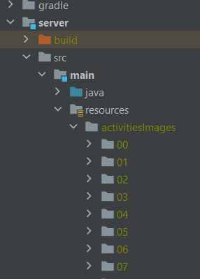

# Starting template

This README will need to contain a description of your project, how to run it, how to set up the development environment, and who worked on it.
This information can be added throughout the course, except for the names of the group members.
Add your own name (do not add the names for others!) to the section below.

## Description of project

## Group members
Play a quiz game about energy that will hopefully raise your energy awareness!

## Group members 
| Profile Picture                                                                                         | Name                    | Email                           |
|---------------------------------------------------------------------------------------------------------|-------------------------|---------------------------------|
|  | Alexandru-Nicolae Ojica | A.N.Ojica-1@student.tudelft.nl  |
|  | Andrei Simionescu | A.Simionescu@student.tudelft.nl |
|  | Arda Cengaver | A.Cengaver@student.tudelft.nl   |
|  | Ilias McAuliffe| I.McAuliffe@student.tudelft.nl  |
|  | Dragos Dumitrescu| D.Dumitrescu@student.tudelft.nl  |
|  | Thys Kok | T.A.Kok@student.tudelft.nl  |

## How to run it

This part will walk you through setting up the project. This set-up was performed on a Windows computer. 

0. Make sure you have added JavaFX to the project configurations.
1. Download the oopp-activities-bank zip from the activity bank on GitLab. Unzip it and copy the json file at the bottom of the map, then add it under 'server/src/main/resources'.
   It should now look like this: 

2. Now create a new directory at the same path named 'activitiesImages'. Copy into that directory the other folders contained in the activity bank map, these
   are numbered 00 - 78. This should be the result: 

3. Last step: Create a new directory under 'client/src/main/resources/images' named 'avatar'.
4. Now you should be good to go! Run the server and then the client, and the project should work! Try it yourself by running the following commands:
   - './gradlew bootRun' to run the server
   - './gradlew run' to run the client

## How to contribute to it

## Copyright / License (opt.)
